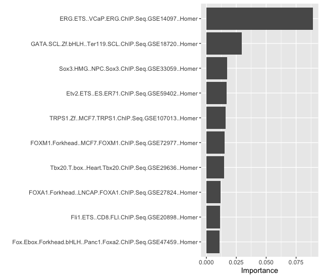

```{r setup, include=FALSE}
knitr::opts_chunk$set(
  echo = FALSE,
  eval = TRUE,
  message = FALSE,
  warning = FALSE)

```

# Data pre-processing

To prepare the data for prediction, I have used recipe which resulted the best out of the various techniques I used. Additionally, I used functions like `step_zv()` which removes a few variables containing single values and `step_nzv()` which removes sparse variables. Lastly, I normalized the data to have a `mean = 0` and `sd = 1` with `step_normalize()`. The function assisted me to suppress the outliers which is demonstrated by the smaller standard deviation of the data scale.


# Summary of important variables

Every variable played some role in predicting the cell-type of mouse but it was not feasible to predict all 1004 variables. Therefore, after pre-processing, I used `prep()` to calculate the mean of each predictor so that it can be centered. I also used `juice()` to extract the transformed training set and resulted reduction in the dimensions in the new dataset.  The reduced and refined variables were the most useful variables for separating the classes for predicting the gene motive. Below graph shows the important variables used for the prediction.

```{r, echo=FALSE, out.width= "70%"}

```

# Model performance

Finally I created a workflow with `workflow()` to aggregate information required to fit and predict from the model. This is used with my best method `xgboost`. It then pruned the tree with similarity score before proceeding with the actual modelling. Because the gradients of the data are evaluated for each tree, the calculation is quick and gave me better results.


# Reference

Wickham et al., (2019). Welcome to the tidyverse. Journal of Open Source
  Software, 4(43), 1686, https://doi.org/10.21105/joss.01686

Kuhn et al., (2020). Tidymodels: a collection of packages for modeling and
  machine learning using tidyverse principles. https://www.tidymodels.org
  
Emil Hvitfeldt (2022). themis: Extra Recipes Steps for Dealing with Unbalanced
  Data. R package version 0.2.2. https://CRAN.R-project.org/package=themis
  
Max Kuhn (2022). caret: Classification and Regression Training. R package
  version 6.0-92. https://CRAN.R-project.org/package=caret

Brandon M. Greenwell and Bradley C. Boehmke (2020). Variable Importance Plots—An
  Introduction to the vip Package. The R Journal, 12(1), 343--366. URL
  https://doi.org/10.32614/RJ-2020-013.


